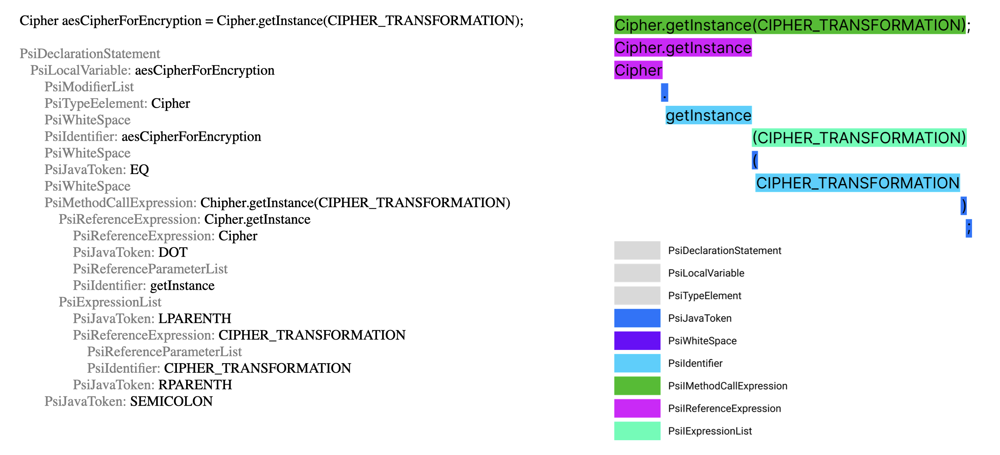
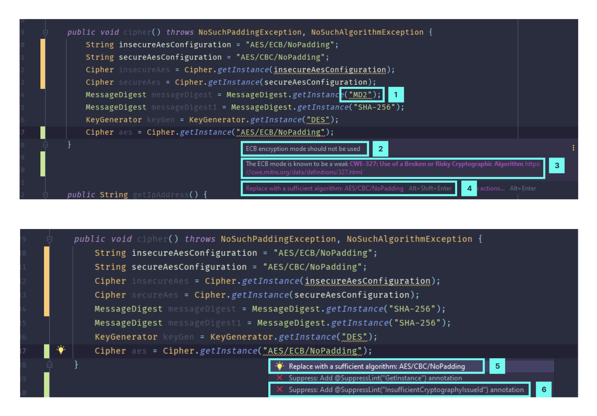
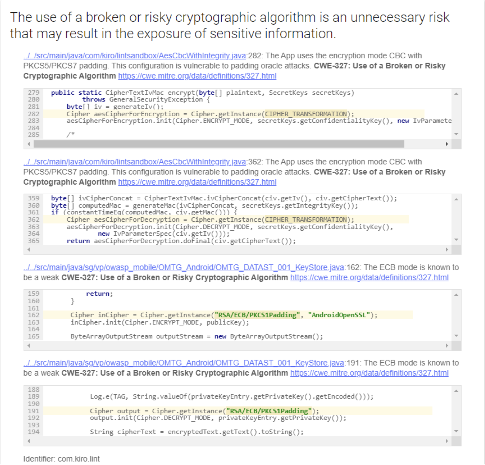

# IDE integrated SAST for Android developers

## Features
- Uses AST for threats detection
- Integrates with IntelliJ platform IDEs and supports convenient fix suggestions
- Integrates to CI/CD pipeline
- Easily configurable with XML and Gradle DSL
- Supports different output formats: XML, SARIF, HTML
- Stops the build if critical issues found
- Scans both Java and Kotlin code

## Supported issues
| Issue | CWE |
|---|---|
| Hidden Elements | [CWE-919: Weaknesses in Mobile Applications](https://cwe.mitre.org/data/definitions/919.html) |
| Incorrect Default Permissions | [CWE-276: Incorrect Default Permissions](https://cwe.mitre.org/data/definitions/276.html) |
| Insecure File Operating Mode | [CWE-276: Incorrect Default Permissions](https://cwe.mitre.org/data/definitions/276.html) |
| Insufficient Cryptography | [CWE-327: Use of a Broken or Risky Cryptographic Algorithm](https://cwe.mitre.org/data/definitions/327.html) |
| Insufficiently Random Values | [CWE-330: Use of Insufficiently Random Values](https://cwe.mitre.org/data/definitions/330.html) |
| IP Address Disclosure | [CWE-200: Information Exposure](https://cwe.mitre.org/data/definitions/200.html) |
| SQL Injection | [CWE-89: SQL Injection](https://cwe.mitre.org/data/definitions/89.html) |
| Insecure WebView Implementation | [CWE-749: Exposed Dangerous Method or Function](https://cwe.mitre.org/data/definitions/749.html) |
| Allow Backup Application | N/A |
| Android Secret Code Usage | N/A |
| Cleartext Traffic Usage | N/A |
| Debuggable Application | N/A |
| Insecure Application Components | N/A |
| Not Protected Application Components | N/A |
| Test Only Application | N/A |

## AST example

## Interface

1. Issue highlight
2. Title
3. Issue description with CWE link
4. Suggested replacement
5. Suggested replacement (in action dialogue)
6. Ability to ignore the issue

## HTMP report

